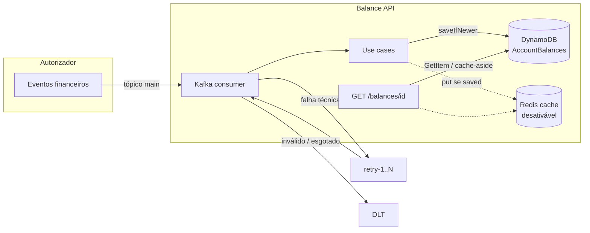
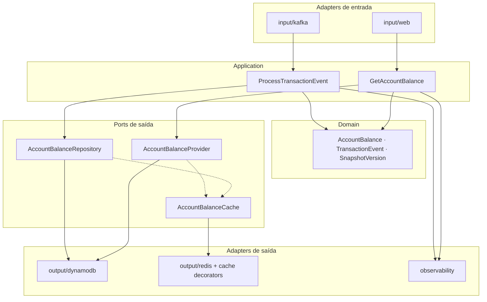
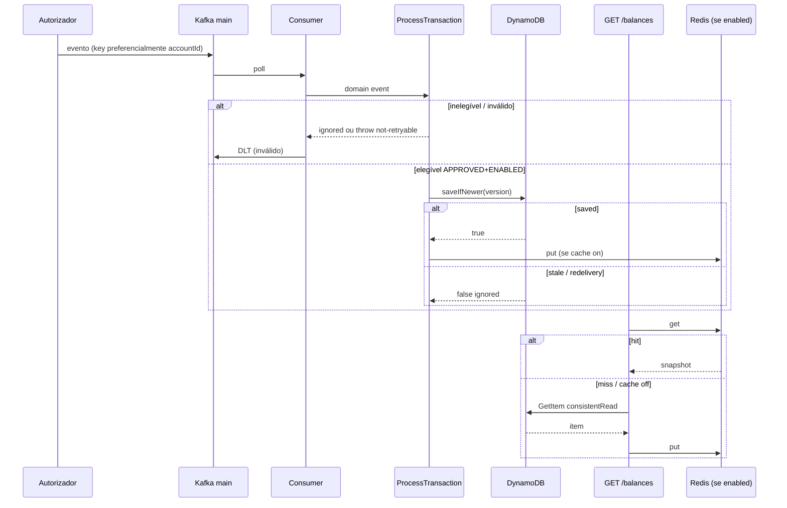
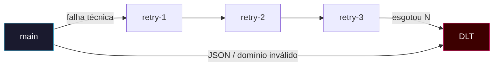
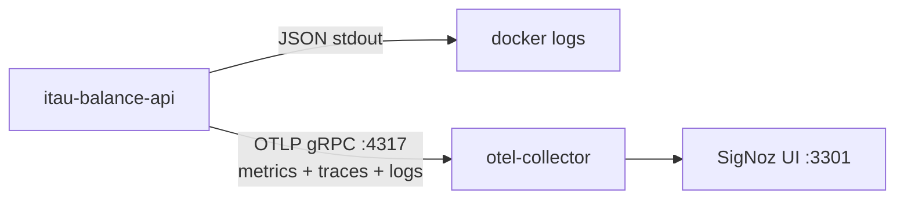

# API de Consulta de Saldo — Desafio Itaú

[](../../actions/workflows/build.yml)
[](../../actions/workflows/test.yml)
[](../../actions/workflows/docker.yml)
[](../../actions/workflows/codeql.yml)

Solução do desafio técnico Itaú Unibanco (branch `kotlin`):

1. **Ingestão** — consumir `transacoes-financeiras-processadas` (Kafka) e persistir o saldo mais atual no DynamoDB  
2. **Exposição** — `GET /balances/{accountId}`

> Snapshot **autoritativo**: o saldo vem do evento. A app **não** recalcula CREDIT/DEBIT.

---

## Mapa da documentação

| Doc | Quando ler |
|-----|------------|
| **[docs/DECISIONS.md](docs/DECISIONS.md)** | ADRs (hex, versionamento, retry/backoff, cache, CB) |
| **[docs/LIMITATIONS.md](docs/LIMITATIONS.md)** | O que **não** é production-grade (honesto) |
| **[docs/PRODUCTION.md](docs/PRODUCTION.md)** | Checklist ops / envs / runbook |
| **[docs/CAPACITY.md](docs/CAPACITY.md)** | Capacidade local e alvos ilustrativos |
| **[docs/LOAD.md](docs/LOAD.md)** | Gatling + load Kafka |
| **[docs/CHAOS.md](docs/CHAOS.md)** | Drills Compose (pause, latency, DLT…) |
| **[docs/REVIEW.md](docs/REVIEW.md)** | `make review-demo` — walkthrough do revisor |
| **[infra/signoz/README.md](infra/signoz/README.md)** | SigNoz local + OTLP |
| **[infra/signoz/DASHBOARDS.md](infra/signoz/DASHBOARDS.md)** | 7 dashboards provisionados |
| **[openapi.yaml](src/main/resources/static/openapi.yaml)** | Contrato HTTP |

---

## No dia a dia, você vai se deparar com perguntas como:

| Pergunta | Resposta nesta solução |
|----------|------------------------|
| Como garantir consistência quando 2 débitos chegam no mesmo instante? | Snapshot + `PutItem` condicional em `(updated_at_micros, last_transaction_id)` — atômico, sem lock distribuído |
| Como escalar sem degradar latência? | Partições Kafka (3) + `listener.concurrency=3`; cache Redis (**on por default**, desligável); scale-out de pods ≤ partições |
| Como publicar uma mudança sem impactar milhões de clientes? | Kill switches por env; `server.shutdown=graceful`; contrato Kafka evolutivo; poison → DLT; hops async no retry |

Detalhes e trade-offs → [DECISIONS.md](docs/DECISIONS.md) · gaps → [LIMITATIONS.md](docs/LIMITATIONS.md)

---

## Visão geral



| Caminho | Entrada | Saída |
|---------|---------|--------|
| Write | Kafka `transacoes-financeiras-processadas` | Snapshot no DynamoDB (se mais novo) |
| Read | `GET /balances/{accountId}` | JSON do saldo + `updated_at` ISO-8601 |
| Degradação | JSON/domínio inválido | DLT imediato |
| Degradação | falha técnica (ex.: Dynamo down) | hops `….retry-N` → DLT |

---

## Stack

| Camada | Tecnologia |
|--------|------------|
| Linguagem | Kotlin 2.3 / Java 21 |
| Runtime | Spring Boot 4.1 |
| Store | DynamoDB (AWS SDK v2) · Local + Toxiproxy no Compose |
| Mensageria | Spring Kafka · Redpanda local |
| Cache | Redis cache-aside (**on por default**; desliga com `BALANCE_CACHE_ENABLED=false` / `make up-no-cache`) |
| Resiliência | Resilience4j CB + bulkhead de leitura DynamoDB |
| Testes | JUnit 5 · MockMvc · Konsist · IT Docker · Gatling |
| Cobertura | JaCoCo ≥ 90% instruction (`./gradlew check`) |
| Obs | Logs JSON stdout **+** OTLP/gRPC (logs · metrics · traces) · Actuator |
| Packaging | Docker multi-stage (non-root) + Compose |

---

## Arquitetura hexagonal



Regra de dependência enforced por `HexagonalArchitectureTest` (Konsist): `domain` sem Spring; `application` não depende de `adapter`.

Pacote: `src/main/kotlin/br/com/itau/challenge/balance/{domain,port,application,adapter}` + `config/`.

ADRs completos → [DECISIONS.md](docs/DECISIONS.md)

---

## Fluxo de ingestão e leitura



**Versão do snapshot:** `(updated_at_micros, last_transaction_id)` — maior timestamp ganha; empate de µs desempata por `transaction.id` lexicográfico; mesmo par = redelivery (ignora).

Contrato HTTP e erros → [openapi.yaml](src/main/resources/static/openapi.yaml) · exemplos → [`http/balances.http`](http/balances.http)

---

## Retry async multi-tópico + DLT



| Item | Valor |
|------|--------|
| Main | `transacoes-financeiras-processadas` (3 partições) |
| Retry | `….retry-1..N` · `N = TRANSACTIONS_RETRY_MAX_ATTEMPTS` (default 3) |
| DLT | `….DLT` |
| Main path | `FixedBackOff(0,0)` — **sem sleep no main** (libera partição na hora) |
| Backoff temporal | header `x-retry-not-before-ms` (exp + full jitter 1s→…≤30s); **retry listener** espera o deadline |
| Not-retryable | JSON/domínio inválidos → DLT; NPE/IAE **retentam** |
| Kill switch | `TRANSACTIONS_INGESTION_ENABLED` |

Detalhes → [DECISIONS.md §6](docs/DECISIONS.md) · [LIMITATIONS.md §3](docs/LIMITATIONS.md) · drill → [CHAOS.md](docs/CHAOS.md)

---

## Modelo DynamoDB (resumo)

| | |
|-|-|
| Tabela | `AccountBalances` |
| PK | `account_id` (S) — sem SK/GSI |
| Escrita | `PutItem` condicional `saveIfNewer` |
| Leitura | `GetItem` + `consistentRead=true` (default) |
| Atributos | `owner`, `balance_*`, `updated_at_micros`, `last_transaction_id` |

Acesso O(1) ao **saldo atual** (não é ledger/histórico). Condição completa e tie-break → [DECISIONS.md](docs/DECISIONS.md)

---

## Resiliência (resumo)

| Mecanismo | Comportamento |
|-----------|----------------|
| CB `dynamodb-read` / `dynamodb-write` | aberto → GET/write falha com **503** `DEPENDENCY_UNAVAILABLE` |
| CB `redis` | fail-open: GET segue no Dynamo |
| CB `kafka-produce` | protege publish retry/DLT |
| Bulkhead leitura Dynamo | limita concorrência do GET |
| Cache | default **on**; put só após `saved`; DEL só se put falhar (não se rejeitar por versão) |

Ops e envs → [PRODUCTION.md](docs/PRODUCTION.md) · capacidade → [CAPACITY.md](docs/CAPACITY.md)

---

## Como rodar (rápido)

Pré-requisito: Docker + Compose.

```bash
make up                                          # app + DynamoDB (+ Toxiproxy) + Redpanda + Redis
curl -s http://localhost:8080/actuator/health/liveness
make kafka-produce-transactions-events \
  TOPIC=transacoes-financeiras-processadas COUNT=20
make db-scan
make stop
```

| Comando | Efeito |
|---------|--------|
| `make up` / `up-cache` | cache **on** (default) |
| `make up-no-cache` | desliga cache Redis |
| `make up-secure` | API key `local-dev-key` + rate limit |
| `make up-no-ingest` | desliga consumer Kafka |
| `make obs-up` | stack + **SigNoz**; OTLP on no app |
| `make review-demo` | boot obs + load + chaos (enche dashboards) |

| URL | Serviço |
|-----|---------|
| http://localhost:8080 | API |
| http://localhost:8001 | DynamoDB Admin |
| http://localhost:8081 | Redpanda Console |
| http://localhost:3301 | SigNoz (`make obs-up`) |

Checklist operacional e envs → [PRODUCTION.md](docs/PRODUCTION.md)

### API (amostra)

```bash
# 200 — saldo (auth on por default; keys em src/main/resources/api-keys.json)
curl -s -H 'X-API-Key: local-dev-key' \
  "http://localhost:8080/balances/<accountId>" | jq .
```

| Status | Código |
|--------|--------|
| 400 | `INVALID_ACCOUNT_ID` |
| 401 | `UNAUTHORIZED` (auth on) |
| 404 | `ACCOUNT_BALANCE_NOT_FOUND` |
| 429 | `RATE_LIMIT_EXCEEDED` (limit on) |
| 503 | `DEPENDENCY_UNAVAILABLE` (CB/store) |
| 500 | `INTERNAL_ERROR` |

Auth default **on** (keys: `api-keys.json` + `API_AUTH_KEYS`). Rate-limit default **off**. → [LIMITATIONS.md](docs/LIMITATIONS.md)

---

## Makefile (índice)

| Área | Targets |
|------|---------|
| Stack | `up` `up-cache` `up-no-cache` `up-secure` `up-no-ingest` `stop` `logs` |
| Dados | `db-up` `db-scan` `kafka-up` `kafka-produce-transactions-events` |
| Qualidade | `test` `integration-test` `http` |
| Load | `load-seed` `load-smoke` `load-test` `load-kafka` `load-mixed` |
| Obs | `obs-up` `obs-down` `obs-ui` |
| Chaos | `chaos-retry-topics` `chaos-dynamodb-*` `chaos-redis-*` `chaos-poison-dlt` … |
| Review | `review-demo` `review-demo-quick` `review-demo-full` |

```bash
make help   # lista completa
```

---

## Testes e demo de review

```bash
./gradlew check              # unitários + gate 90%
make integration-test        # DynamoDB + Kafka + Redis + E2E

# Load (manual — fora do CI)
make load-seed && make load-smoke
# detalhes: docs/LOAD.md

# Walkthrough do revisor (SigNoz cheio)
make review-demo
# ou stack já no ar:
SKIP_BOOTSTRAP=1 make review-demo-quick
# detalhes: docs/REVIEW.md · chaos: docs/CHAOS.md
```

| Camada | O que cobre |
|--------|-------------|
| Unit | domínio, versionamento, consumer, REST, CB wiring |
| Architecture | Konsist hexagonal |
| Integration | Kafka→Dynamo→REST, cache, async retry→DLT |
| Load | GET (Gatling) + produce Kafka — [LOAD.md](docs/LOAD.md) |
| Chaos | pause/latency/DLT/retry — [CHAOS.md](docs/CHAOS.md) |

---

## Observabilidade



| Sinal | Onde |
|-------|------|
| Liveness / readiness | `/actuator/health/*` (readiness inclui DynamoDB) |
| Métricas + traces + **logs** | **mesmo** OTLP/gRPC `:4317` (não é caminho separado) |
| Counters | `balance.transactions{result}` · `balance.queries{result}` · `balance.cache{result}` |
| Dashboards | Overview · Ingestion · API · Cache · Resilience · Errors · Health |

Stdout JSON **sempre** (local/`docker logs`). Export OTLP (métricas, traces **e** logs) é o mesmo pipeline gRPC:

- **`make up`:** OTLP **off** no app (sem collector no path padrão)
- **`make obs-up`:** liga os **três** sinais OTLP (metrics + tracing + logs) → collector `:4317`

Setup → [infra/signoz/README.md](infra/signoz/README.md) · painéis → [DASHBOARDS.md](infra/signoz/DASHBOARDS.md) · demo → [REVIEW.md](docs/REVIEW.md)

---

## Decisões em uma página

1. Snapshot autoritativo por timestamp (não recalcula saldo).  
2. Escrita atômica condicional `(updated_at_micros, last_transaction_id)`.  
3. PK só `account_id` — GetItem O(1), sem GSI.  
4. Inválido → DLT; técnico → hops `….retry-N` → DLT (main **sem sleep**; retry listener honra `x-retry-not-before-ms`).  
5. GET com leitura fortemente consistente.  
6. Cache Redis de primeira classe (**on por default**; `BALANCE_CACHE_ENABLED=false` desliga), fail-open.  
7. CBs split: `dynamodb-read` / `dynamodb-write` / `redis` / `kafka-produce` + bulkhead GET.  
8. Observabilidade: stdout JSON + OTLP/gRPC para **metrics, traces e logs** (export off no `make up`; on no `make obs-up`).

Tudo justificado → [DECISIONS.md](docs/DECISIONS.md) · o que falta p/ prod real → [LIMITATIONS.md](docs/LIMITATIONS.md) · operar → [PRODUCTION.md](docs/PRODUCTION.md)

---

## Entrega

Repositório público na branch `kotlin`.  
Não incluir o PDF do desafio no repo.
